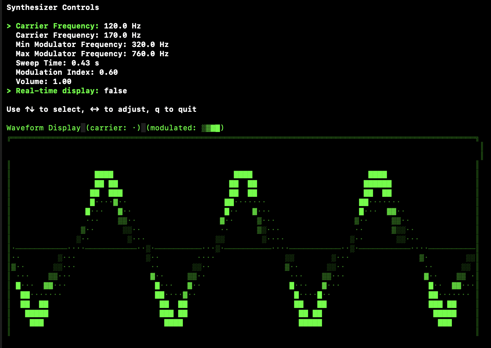

# gosynth
A simple synth TUI



## Installation

Install audio and midi drivers
```
brew install portaudio
brew install rtmidi
```

Get the Go libraries
```
go get github.com/charmbracelet/bubbletea
go get github.com/gordonklaus/portaudio
go get gitlab.com/gomidi/midi/v2/drivers/rtmididrv
```

Install and run
```
go install
gosynth
```
